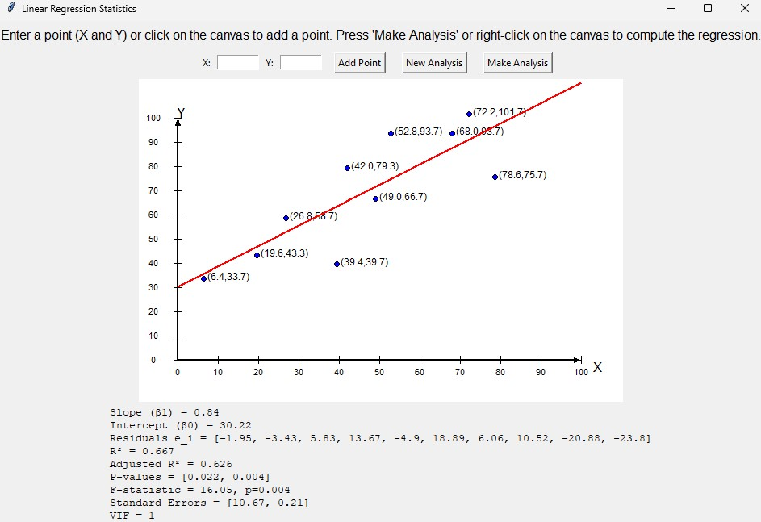

# Linear Regression Interactive Tool

## Overview
The **Linear Regression Interactive Tool** is a Python GUI application that allows users to interactively input 2D data points and perform simple linear regression analysis. The tool provides an intuitive interface to add points manually or by clicking on a canvas and instantly visualize the regression line and key statistical metrics.

---

## Features
- **Interactive Point Input:** Add data points by clicking on the canvas or typing X and Y coordinates in the input fields.  
- **Regression Analysis:** Perform linear regression using the "Make Analysis" button or by right-clicking on the canvas.  
- **Visual Feedback:** Display points on the canvas and plot the regression line in real-time.  
- **Statistical Metrics:** View slope, intercept, residuals, R², adjusted R², standard errors, p-values, F-statistic, and variance inflation factor (VIF).  
- **Reset Functionality:** Use the "New Analysis" button to clear all points and results and start a new analysis.  
- **Rounded & Readable Output:** Statistics are rounded and formatted for clarity.  

---

## Dependencies
The program relies on the following Python packages:

- `tkinter` – For GUI interface (canvas, labels, buttons).  
- `numpy` – For numerical calculations and array handling.  
- `statsmodels` – For performing Ordinary Least Squares (OLS) regression and computing statistical metrics.  

Install the dependencies using pip:

```bash
pip install numpy statsmodels
```
## Usage

***Add Points:***

Click on the canvas to add a point or type X and Y coordinates in the input fields and click Add Point.

***Perform Regression Analysis:***

Click Make Analysis or right-click on the canvas. The regression line will appear on the canvas, and the statistical summary will display below.

***Start a New Analysis:***

Click New Analysis to clear all points and results. This resets the canvas and allows you to start over.

## Screenshots


## Author
tauimonen

## License

This project is licensed under the MIT License – see the [LICENSE](LICENSE) file for details.
